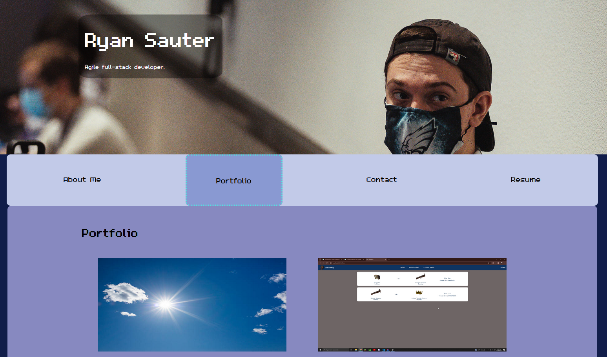
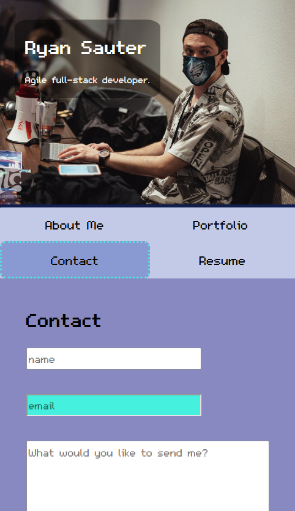

# Portfolio 2.0
  

## Description
A portfolio is essential for any programmer. It's especially essential when it teaches that programmer the most sought-after framework on the web! ReactJS was a beast to conquer, and there's still plenty more to learn, but now I feel I have a grasp on the technology. This project also helped elevate my front-end skills, by creating all the CSS myself and engaging with hovers and opacity to create a very responsive design for the website. I will happily send this to employers as a showcase of my prowess.

## Table of Contents
- [Installation](#installation)
- [Usage](#usage)
- [Contributions](#contributions)
- [License](#license)
- [Questions](#questions)

## Installation
This program is a web application, no installation needed.
[Access the website by clicking here!](https://65c27e76ea2b7c000805429b--zippy-lollipop-6d9602.netlify.app/)

## Usage

The website contains four pages, available by clicking on the different page names in the navigation bar. The homepage is a short biography section. The portfolio section contains project cards which, when hovered over, reveal the details of each project, as well as the repository link by clicking on the GitHub icons. The contact page holds a form with error messages if anything attempts to get submitted without all information. The resume section lists my proficiencies in Web Development, as well as a clickable link to download my resume. The footer contains icons with clickable links to my profiles on other important platforms.

## Contributions
If you wish to contribute to this project, please include this simple statement below with any non-trivial patches. 

`I dedicate any and all copyright interest in this software to the public domain. I make this dedication for the benefit of the public at large and to the detriment of my heirs and successors. I intend this dedication to be an overt act of relinquishment in perpetuity of all present and future rights to this software under copyright law.`

## License
[The Unlicense](http://unlicense.org/)

This software operates under The Unlicense. If you would like to learn more, please click on the link above.

## Questions
[Github](https://github.com/RedKnight88)

Email: ryansauter88@gmail.com
